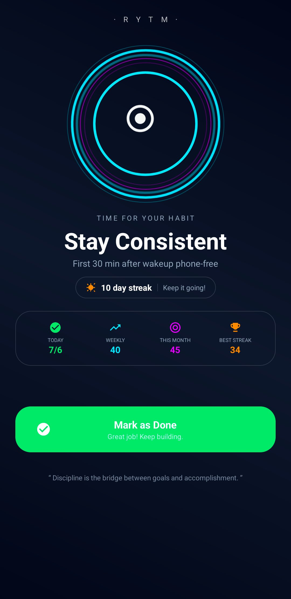
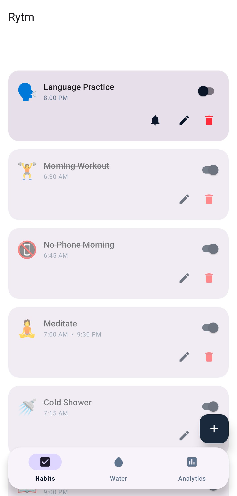
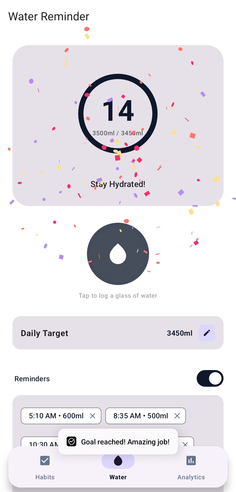
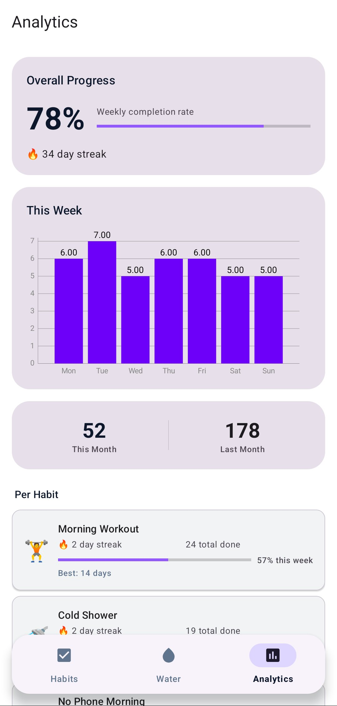

<div align="center">


# Rytm

**A habit & hydration companion for Android that's built to actually make you follow through.**

Rytm doesn't just remind you — it rings full-screen over your lock screen, tracks your streaks, and nudges you with identity-based motivation drawn from *Atomic Habits*, so a reminder is hard to ignore and easy to act on.

[](#)
[](#)
[](#)
[](#)
[](LICENSE)

### [⬇ Download the APK](https://github.com/hariharan-a-cyber/Rytm/releases/tag/v1.0)

<sub>Requires Android 8.0 (Oreo) or newer. You may need to allow "Install from unknown sources".</sub>

</div>

---

## Overview

Most reminder apps fail at the one job that matters: getting the reminder in front of you at the right moment, reliably, on a modern phone that aggressively kills background work. Rytm is a focused, offline-first habit and water tracker whose core design goal is **reliable, persuasive follow-through** — every part of the app is built around making the user actually complete what they set out to do.

It pairs that reliability with a deliberately motivating UX: a cinematic full-screen alarm, live streaks, celebratory feedback, and behavioural nudges based on James Clear's *Atomic Habits*.

---

## Screenshots

<div align="center">
<table>
  <tr>
    <td align="center" width="50%">
      <br/>
      <b>Full-screen habit alarm</b><br/>
      <sub>Rings over the lock screen with live streak &amp; stats</sub>
    </td>
    <td align="center" width="50%">
      <br/>
      <b>Habits</b><br/>
      <sub>Per-habit reminders, quick toggle, edit &amp; delete</sub>
    </td>
  </tr>
  <tr>
    <td align="center" width="50%">
      <br/>
      <b>Hydration</b><br/>
      <sub>Tap to log, daily target, confetti on goal reached</sub>
    </td>
    <td align="center" width="50%">
      <br/>
      <b>Analytics</b><br/>
      <sub>Weekly chart, streaks, per-habit stats, backup</sub>
    </td>
  </tr>
</table>
</div>

---

## Features

### Habits
- Create habits with an emoji, description, **one or more daily reminders**, and a custom repeat-day schedule.
- Each reminder fires a **full-screen alarm** that shows over the lock screen with sound, vibration, and a wake-up — not just a dismissible notification.
- **Mark as Done / Snooze (10 min)** directly from the alarm screen; completing a reminder updates streaks instantly.
- Enable/disable, edit, or delete any habit inline.

### Hydration
- Daily water goal with a tappable ring to log a glass at a time.
- Editable daily target and **independent water reminders** at custom times and amounts.
- **Confetti celebration** when the daily goal is reached.

### Analytics
- Overall weekly completion rate, current streak, and a **7-day bar chart** (MPAndroidChart).
- This-month vs. last-month totals and **per-habit breakdown** (streak, total done, best streak, weekly %).
- **Import / Export** full backups as JSON so tracking history is never lost.

### Built on *Atomic Habits*
- **Identity-based habits** — attach an identity ("I am a healthy person"); completing a reminder is framed as *a vote* for that identity.
- **Habit stacking / implementation intention** — an optional cue ("After I pour my morning coffee").
- **The 2-minute rule** — a scaled-down version shown at alarm time ("Too tired? Just put on your shoes").
- **Never miss twice** — if a habit was missed yesterday, the next missed-reminder escalates its message to keep the chain alive.
- **Make it satisfying** — streaks, progress, and celebration are front-and-centre.

### Reliability
- Survives reboots and clock/time-zone changes (alarms are rescheduled automatically).
- Notifications work even when posted before the app's UI has launched (e.g. right after boot).
- Missed reminders are recorded, surfaced, and rescheduled so a habit never silently stops firing.

---

## Tech Stack

| Layer | Technology |
|---|---|
| Language | Kotlin |
| Architecture | MVVM + Repository, single-Activity with Navigation |
| UI | Android Views, Material 3, ViewBinding, MPAndroidChart, Konfetti |
| Persistence | Room (SQLite) + DataStore Preferences |
| Dependency Injection | Hilt |
| Async | Kotlin Coroutines + Flow |
| Background / scheduling | AlarmManager, foreground Service, WorkManager, BroadcastReceivers |
| Serialization | Gson (backup import/export) |

---

## Architecture

Rytm follows a clean MVVM structure with a single source of truth in the Room database, exposed reactively through a repository.

```
┌──────────────────────────────────────────────────────────┐
│  UI (Fragments / Activities)                             │
│  Habits · Hydration · Analytics · Full-screen Alarm      │
└───────────────▲──────────────────────────┬───────────────┘
                │ observes StateFlow        │ user actions
┌───────────────┴──────────────────────────▼───────────────┐
│  ViewModels (Hilt-injected)                              │
└───────────────▲──────────────────────────┬───────────────┘
                │                           │
┌───────────────┴──────────────────────────▼───────────────┐
│  HabitRepository  (single source of truth)               │
└───────────────▲──────────────────────────┬───────────────┘
                │ Flow                      │ suspend
┌───────────────┴──────────────────────────▼───────────────┐
│  Room DAOs / Entities          DataStore (settings)      │
└──────────────────────────────────────────────────────────┘

        Scheduling & delivery (outside the UI lifecycle)
   AlarmScheduler → AlarmManager → AlarmReceiver → AlarmService
   BootReceiver · TimeChangeReceiver · DailySummaryReceiver
```

**Project layout**

```
app/src/main/java/com/hariharan/rytm/
├── data/
│   ├── entity/        # Habit, Reminder, WaterReminder, CompletionLog, AppBackup …
│   ├── dao/           # Room DAOs
│   └── database/      # AppDatabase + migrations
├── di/                # Hilt modules
├── repository/        # HabitRepository (single source of truth)
├── viewmodel/         # Per-screen ViewModels
├── ui/
│   ├── habits/        # Habit list + add/edit
│   ├── water/         # Hydration
│   ├── analytics/     # Charts, stats, backup
│   ├── alarm/         # Full-screen ring activities
│   └── SplashActivity, MainActivity
├── service/           # AlarmService (foreground)
├── receiver/          # Boot, AlarmReceiver, TimeChange, DailySummary
└── utils/             # AlarmScheduler
```

---

## Engineering Challenges

The interesting part of Rytm wasn't the UI — it was making reminders *fire reliably* on modern Android and recover gracefully when things go wrong. The hardest problems:

### 1. Delivering an alarm that can't be ignored
A normal notification is too easy to swipe away, and modern Android (Doze, app standby, OEM battery killers) actively suppresses background work. Rytm uses `AlarmManager.setAlarmClock()` for Doze-exempt exact timing, a **foreground Service** to play the alarm, a **full-screen intent** to launch a ring screen over the lock screen, and wake locks to turn the screen on — coordinated so the alarm behaves like a real clock alarm rather than a best-effort ping.

### 2. A race condition that silently swallowed "missed" notifications
The thorniest bug: two independent 30-second timers ran for every alarm — one in the foreground Service (which posted the *missed* notification, logged it, and rescheduled) and one in the ring Activity (which stopped the Service when it timed out). They raced, and whenever the Activity won, stopping the Service **cancelled the Service's still-pending miss-handling** — so missed notifications sometimes never appeared, or appeared and vanished. The fix made the Service the single owner of miss-handling and moved that work onto an **independent coroutine scope** that `stopSelf()` can't cancel, with a guard flag to prevent a completed reminder from also being logged as missed.

### 3. One-shot alarms that must re-book themselves
`AlarmManager` alarms fire once. Completing or skipping a habit rescheduled it — but a *missed* habit originally didn't, so a single miss could silently stop a habit from ever firing again. Now every outcome (done, skipped, missed, snoozed, late/stale delivery) deterministically reschedules the next occurrence.

### 4. Notifications dropped because their channel didn't exist yet
On Android 8+, posting to a notification channel that hasn't been created is silently discarded. Some notifications are posted at **boot** — before any screen or Service has run — so their channels didn't exist. Channels are now created in `Application.onCreate()`, guaranteeing they exist before anything posts to them.

### 5. Evolving the schema without losing user data
Adding the *Atomic Habits* fields (identity, cue, 2-minute version) required a Room schema change. Rather than wipe-and-recreate, Rytm ships a proper **non-destructive `Migration`**, so existing habits, logs, streaks, and JSON backups all survive an upgrade.

### 6. Surviving reboots, clock changes, and late delivery
Exact alarms are lost on reboot and can drift on time-zone changes, and Doze can deliver an alarm minutes late. Rytm reschedules everything on `BOOT_COMPLETED` and time changes, and treats a stale/late alarm as a recoverable "missed" event instead of dropping it.

> **Lesson learned:** a large mid-project refactor (a full package rename) taught the value of UTF-8 discipline and tight, reviewable diffs — an automated rewrite once re-encoded source files as ASCII and turned every emoji into `?`. Small, verifiable changes beat sweeping ones.

---

## Permissions & why they're needed

| Permission | Purpose |
|---|---|
| `SCHEDULE_EXACT_ALARM` / `USE_EXACT_ALARM` | Fire reminders at the exact minute |
| `USE_FULL_SCREEN_INTENT` | Show the alarm over the lock screen |
| `POST_NOTIFICATIONS` | Reminder & missed-habit notifications (Android 13+) |
| `FOREGROUND_SERVICE` (+ `MEDIA_PLAYBACK`) | Play the alarm reliably |
| `RECEIVE_BOOT_COMPLETED` | Reschedule alarms after a reboot |
| `WAKE_LOCK` / `VIBRATE` | Wake the screen and vibrate on alarm |
| `REQUEST_IGNORE_BATTERY_OPTIMIZATIONS` | Ask to be exempt from aggressive battery killing |

---

## Build & Run

**Requirements:** Android Studio (Ladybug or newer), JDK 17, Android SDK 34.

```bash
git clone https://github.com/hariharan-a-cyber/Rytm.git
cd Rytm
# open in Android Studio, let Gradle sync, then Run ▶
# or build a debug APK from the command line:
./gradlew assembleDebug
```

The compiled debug APK lands in `app/build/outputs/apk/debug/`. A prebuilt APK is also available at **[release/Rytm.apk](https://github.com/hariharan-a-cyber/Rytm/releases/tag/v1.0)**.

---

## Known Limitations

- If two different reminders are scheduled for the **same minute**, the single shared alarm Service handles one of them — a deliberate trade-off to keep the alarm pipeline simple.
- Some OEMs (Xiaomi, Oppo, etc.) require manually granting "Autostart" / disabling battery optimization for background alarms to be fully reliable.

---

## Roadmap

- Per-reminder snooze duration
- Widgets and a quick-add tile
- Optional cloud sync for backups
- Finishing multi-alarm handling for same-minute reminders

---

## License

Released under the **MIT License** — see [LICENSE](LICENSE).

---

<div align="center">
<sub>Built with Kotlin for Android · Habit science from <i>Atomic Habits</i> by James Clear.</sub><br/>
<sub>© 2026 Hari</sub>
</div>
